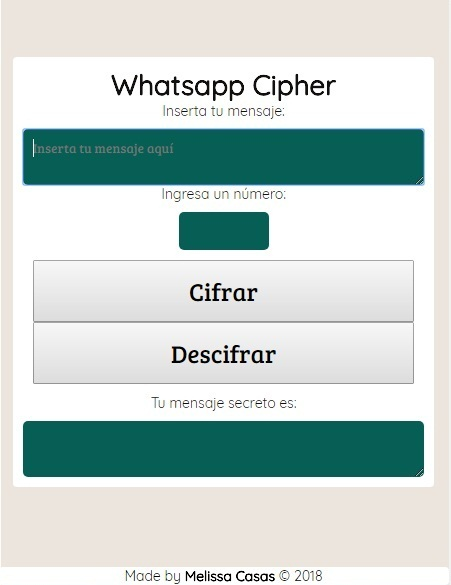

## Whatsapp Cipher APP
Esta aplicación le permite al usuario cifrar y descifrar mensajes, además cuenta con una opción que le permite indicar la cantidad de desplazamiento.  Está diseñado con una interfaz sencilla, fácil de utilizar, y responsive. Para la elaboración del producto final se utilizaron las siguientes herramientas: HTML, CSS, Javascript. Para los test, se empleó Node JS. Está diseñado con uno de los métodos de codificación más antiguos: el Cifrado de César.

## Definición del producto

### ¿Quiénes son los principales usuarios de producto?
 Los principales usuarios son personas entre 17 a 30 años.
 
### ¿Cuáles son los objetivos de estos usuarios en relación con el producto?
EL objetivo de estos usuarios es ocultar el contenido de sus mensajes, para esto se les brinda un metodo de encriptación.

### ¿Cómo crees que el producto que estás creando les está resolviendo sus problemas?
Ante la problemática de cómo poder enviar mensajes para organizar  una fiesta sorpresa, se crea  "Whatsapp Cipher", aplicación que facilita las opciones de cifrar y descifrar mensajes, de manera rápida y eficiente. Ahorrando tiempo al usuario con esta herramienta  y  ofreciéndole  tranquilidad y privacidad, en caso de que alguien más revise sus conversaciones de WhatsApp.

## Whatsapp Cipher APP
 
 

##Diseño del producto

 

1)Investigación

2)Herramientas de trabajo

3)Prototipo y diagrana de flujo

4) HTML y Javascript

5) Javascript

6) Testing

7) CSS

8) Desplegarlo en GH-pages y Read-me

## Descripción del producto
Ahora puedes mantener tus mensajes secretos, seguros y privados, lejos de las manos equivocadas.  
• Tú elijes la cantidad de desplazamiento para tus mensajes, de esta forma puedes crear miles y diferentes mensajes secretos.
• Tienes la opción de cifrar y descifrar cualquier texto.
• Seguro y fácil de usar. Basta de preocuparte por lo que escribes. ¡Ya nadie te descubrirá, wasappea ya!

## ¿Cómo acceder a la aplicación?

Solo debes ingresar al siguiente link (versión web del aplicativo):  
https://marimeli.github.io/lim-2018-05-bc-core-pm-cipher/src/

Es gratuito y libre de virus.

## ¿Cómo ejecutar la aplicación?

Pasos:

1)	Ingresa al link de la aplicación.

2)	Haz click en “Empezar”

3)	En el recuadro “Inserta tu mensaje”, escribe el mensaje que deseas cifrar o descifrar.

4)	En el recuadro  “Ingresa un número”, digita un número. Este será la cantidad de desplazamiento que se moverá hacia la derecha. En el caso de que quieras descifrar, coloca la clave que te han indicado. 

5)	Elige una opción: Si deseas cifrar un mensaje, haz clic en el botón “Cifrar”.

Si deseas descifrar un mensaje, haz clic en el botón “Descifrar”.

6)	En el recuadro  “Tu mensaje secreto es” visualizarás tu mensaje cifrado o descifrado, según la opci+on que hayas elegido.

